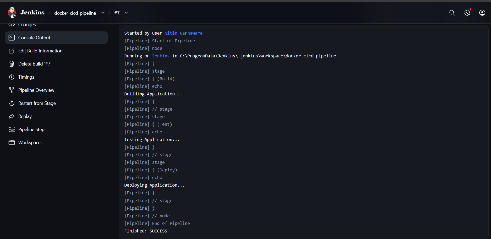

# Jenkins CI/CD Pipeline Project

## Overview

This project demonstrates a basic CI/CD pipeline implemented using Jenkins. The pipeline automates the Build, Test, and Deploy stages to simulate a continuous integration workflow.

## Tech Stack

* Jenkins
* GitHub
* Groovy Pipeline
* Java 21

## Features

* Automated Build Stage
* Automated Test Stage
* Automated Deploy Stage
* Pipeline as Code using Jenkinsfile
* Continuous Integration Workflow

## Pipeline Stages

1. Build
2. Test
3. Deploy

## Project Structure

├── Jenkinsfile
├── README.md
└── screenshots/

## Build Status

Successfully executed Jenkins Pipeline with all stages completed.

Status: SUCCESS

## Pipeline Execution Screenshot

