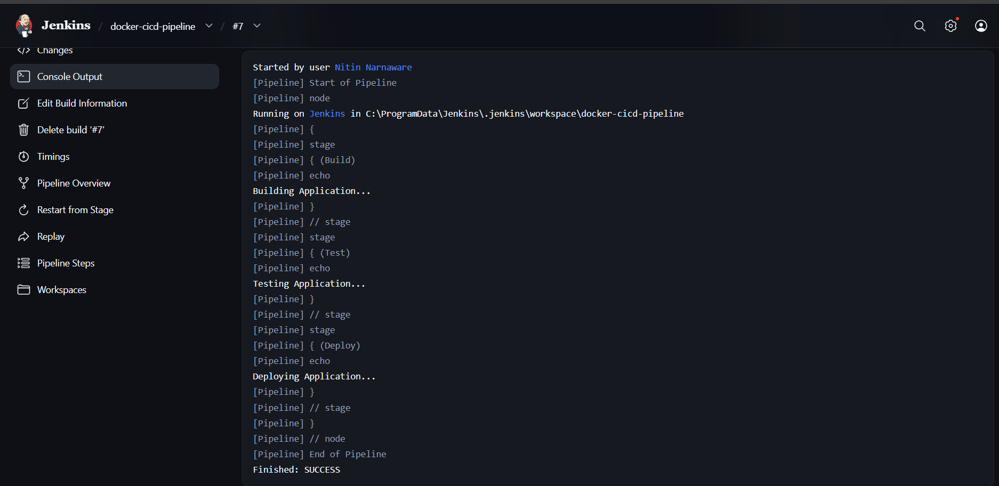

# 🚀 Jenkins CI/CD Pipeline

A Jenkins-based CI/CD pipeline demonstrating automated Build, Test, and Deploy stages using Pipeline as Code with a Jenkinsfile.

## 📌 Overview

This project demonstrates a basic Continuous Integration workflow implemented using Jenkins.

The pipeline automates three stages:

Build → Test → Deploy

The project uses a Jenkinsfile to define the pipeline as code and GitHub as the source code repository.

## 🛠️ Tech Stack

| Technology | Purpose |
|------------|---------|
| Jenkins | CI/CD automation |
| GitHub | Source code management |
| Groovy | Jenkins Pipeline scripting |
| Java 21 | Application runtime |

## 🚀 Features

- Automated Build Stage
- Automated Test Stage
- Automated Deploy Stage
- Pipeline as Code using Jenkinsfile
- GitHub integration
- Continuous Integration workflow

## 🔄 Pipeline Stages

### 1. Build

Builds the application as part of the CI pipeline.

### 2. Test

Runs the configured testing stage to validate the build.

### 3. Deploy

Executes the deployment stage after successful previous stages.

## 📂 Project Structure

jenkins-cicd-pipeline/
├── Jenkinsfile
├── README.md
└── screenshots/
    └── jenkins-success-build.png

## ⚙️ Pipeline Flow

GitHub
   ↓
Jenkins
   ↓
Build
   ↓
Test
   ↓
Deploy
   ↓
SUCCESS

## 📋 Jenkinsfile

The Jenkinsfile defines the CI/CD pipeline stages as code, making the pipeline configuration version-controlled and repeatable.

## ✅ Build Status

The Jenkins pipeline was successfully executed with all configured stages completed.

Status: SUCCESS

## 📸 Pipeline Execution

## 🎯 Skills Demonstrated

- Jenkins CI/CD
- Pipeline as Code
- Jenkinsfile
- Groovy Pipeline
- GitHub integration
- Automated Build
- Automated Testing
- Automated Deployment
- Continuous Integration

## 👨‍💻 Author

Nitin Narnaware

DevOps & Cloud Engineer

LinkedIn: https://www.linkedin.com/in/nitin-narnaware-devops/

Portfolio: https://nitin-narnaware-devops-portfolio.vercel.app

GitHub: https://github.com/narnawarenitin1998-bit
